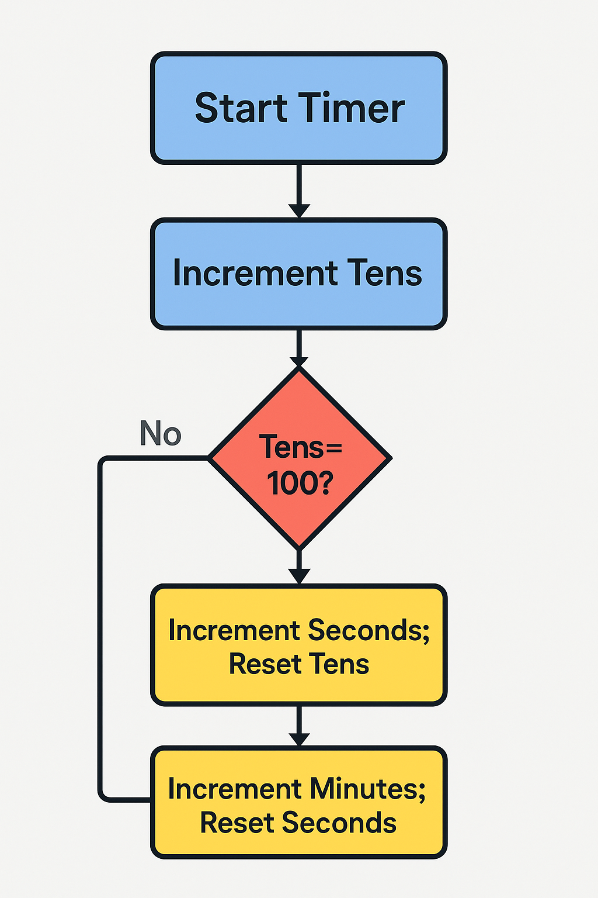

# 🕒 Simple Stopwatch

## Explanation
This stopwatch is a small web app made using **HTML**, **CSS**, and **JavaScript**.

---

## 🔧 How It Works:

### HTML (Structure):
- Displays the time using three `` elements for **minutes**, **seconds**, and **tens** (formatted as `00:00:00`).
- Includes three buttons: **Start**, **Stop**, and **Reset**.

### CSS (Style):
- Centers the stopwatch on the screen.
- Provides styled buttons and a readable time display.

### JavaScript (Functionality):
- **Start Button**: Begins the timer using `setInterval()` — it increases the "tens" every 10 milliseconds.
- **Stop Button**: Stops the timer using `clearInterval()`.
- **Reset Button**: Stops the timer and resets all time values back to `00:00:00`.
- As the "tens" reach 100, it turns into 1 second. When seconds reach 60, it becomes 1 minute.

---

## 🧠 Key Concepts Used:
- **`setInterval()`** and **`clearInterval()`** for timing control.
- **DOM manipulation** with `document.querySelector()` to update time on the page.
- Simple **conditional logic** to roll over time units correctly.

[live preview]( https://aizaz6198.github.io/stopwatch/)
